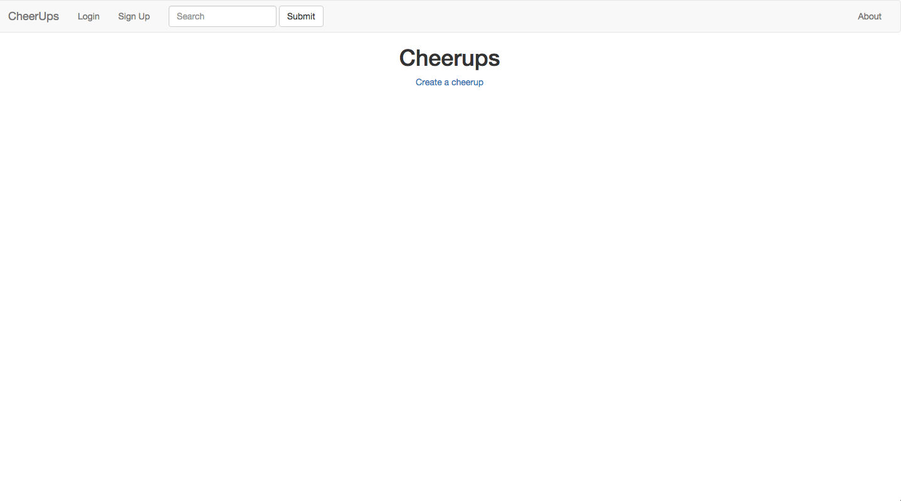

###Project #2: Building Your First Full-stack Application

## Title: Cheerups

##[Cheerups](https://protected-bayou-8659.herokuapp.com/)

1.  Description
2.  Wireframes
3.  Trello
4.  Technologies
5.  Installation/Startup Instructions
6.  Unsolved Problems, Etc

#

##1.  Description

Cheerups is a web application by which registered users can post and share "Cheerups" to make someone smile.  Cheerups typically contain an encouraging image followed by a description.  The user will also have the ability to upvote or downvote a post.

##2.  Wireframes

Wireframes include, but are not limited to: 

https://github.com/JTGA/cheerups/tree/master/assets/wireframes

##3.  Trello

Trello Board:

https://trello.com/b/2o9r7EqG/wdi-project-2

Includes User Stories and Wireframes

##4.  Technologies

Technologies used to build this app include:  Ruby on Rails, HTML, Bootstrap, and CSS/SCSS.  In addition PostgreSQL was used in the formation of the database.  Also, Trello was used for project management and workflow assistance with Entity Relationship Diagrams (ERD) and User Stories.  Heroku is being used as a cloud platform to host the application.

##5.  Installation/Startup Instructions

Instructions for use are straightforward.  Simply direct your browser to the application URL and load the page.  You will have the option to Sign up, Log In, or just browse.  As a registered user you will have the option to create, edit, or delete posts and upload pictures.   You will also have the option to comment on others posts.  It is similar in style to Twitter or Instagram.

##6.  Unsolved Problems, Etc

I would like to add the ability for users to upvote/downvote posts.

